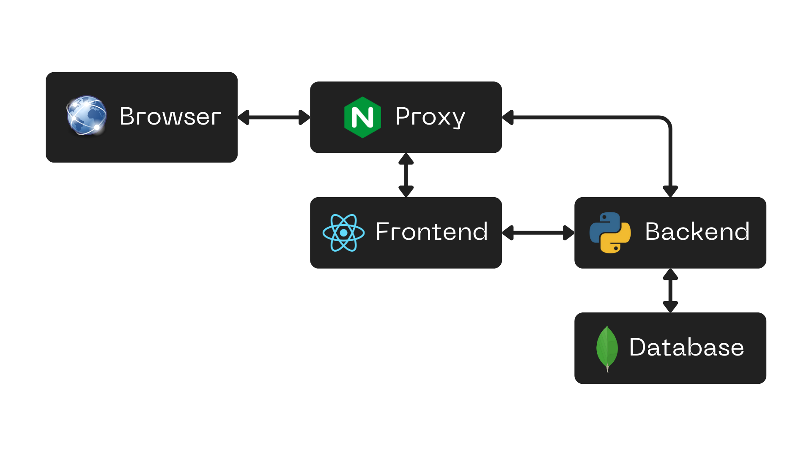

# Architecture Overview

Welcome to the Architecture Overview for SwarmOps. This document explains the modular design of the application and how its various components work together to enable efficient Docker Swarm cluster management.

---

## System Components

SwarmOps is built on a robust modular architecture, comprised of the following key components:

### 1. **Frontend**
- **Technology**: React (with Vite as the build tool).
- **Styling**: TailwindCSS for a sleek and modern design.
- **Code Quality**: Enforced using ESLint.
- **Key Features**:
  - Provides a user-friendly interface for managing clusters, nodes, services, and tasks.
  - Communicates with the backend via REST APIs.

### 2. **Backend**
- **Technology**: Python with Flask framework.
- **Database**: MongoDB for persistent storage.
- **Core Responsibilities**:
  - Serves as the API layer, handling requests from the frontend.
  - Interacts with Docker APIs for managing Swarm clusters.
  - Manages authentication using JSON Web Tokens (JWT).
  - Logs activities and errors for monitoring and debugging.

### 3. **Proxy Container**
- **Technology**: Nginx.
- **Purpose**:
  - Acts as an HTTP reverse proxy to overcome communication challenges between the browser-based web application and the Docker environment.
  - Receives API calls from the browser and routes them to the appropriate Docker container based on the API URL path.

### 4. **Database**
- **Technology**: MongoDB.
- **Purpose**:
  - Stores metadata about clusters, nodes, tasks, and services.
  - Securely holds user credentials using encryption.

### 5. **Automation Tools**
- **Docker**:
  - Automates the deployment of backend, frontend, and database services.
  - Utilizes Docker Compose for defining and managing multi-container applications.
- **Azure Pipelines**:
  - Manages CI/CD workflows to automate testing, building, and deploying the application.

---

## Data Flow and Communication

SwarmOps follows a structured flow to manage data and tasks efficiently:

1. **Frontend to Backend Communication**:
   - The React frontend sends HTTP requests to the Flask backend via REST APIs.
   - Responses include node details, task statuses, and cluster configurations.

2. **Backend to Docker Communication**:
   - The backend interacts directly with Docker APIs to manage nodes, services, and tasks.
   - Ensures that all operations (like scaling a service or inspecting a node) are synchronized with the Docker Swarm cluster.

3. **Proxy Container**:
   - The Nginx proxy container bridges the gap between the browser-based frontend and the Docker environment.
   - It routes API requests from the browser to the appropriate backend or database container.

4. **Database Integration**:
   - MongoDB stores and retrieves data as required by the backend.
   - Data is encrypted where necessary for security.

---

## Architecture Diagram

Below is a diagram that visually represents the SwarmOps architecture:

---

## Deployment Architecture

SwarmOps employs a containerized architecture for seamless deployment:
- **Frontend Container**: Runs the React application, served through Vite.
- **Backend Container**: Hosts the Flask application and connects to the MongoDB database.
- **MongoDB Container**: Provides persistent storage for the application’s data.
- **Proxy Container**: Uses Nginx to route API calls and enable communication between the browser and Docker containers.
- **Docker Compose**: Ensures all containers are orchestrated and can communicate effectively.

---

## Security Measures

SwarmOps implements the following security best practices:
- **Authentication**: Uses JWT for secure user access.
- **Encryption**: Sensitive data is encrypted both in transit and at rest (e.g., MongoDB password storage).
- **Role-Based Access Control (RBAC)**: Granular user permissions managed through the backend.
- **Isolation**: All services are containerized to minimize vulnerabilities.

---

This overview highlights the modular design and operational structure of SwarmOps, ensuring efficient Docker Swarm cluster management and seamless system integration.

---

**[← Go Back to the Administrator Guide](../administrator-guide.md)**