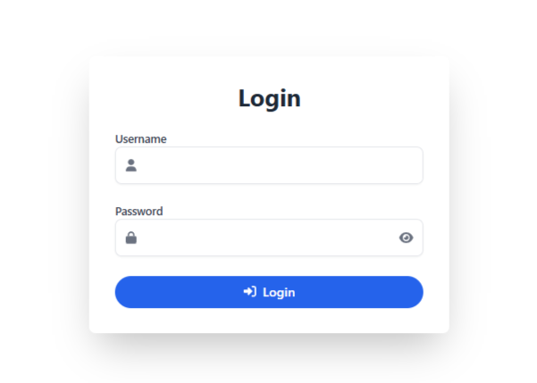
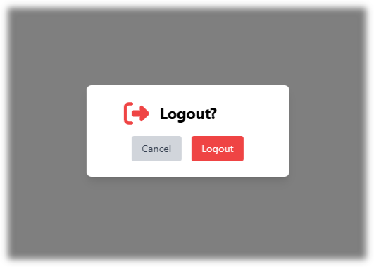

# Login-Logout Functionality

The **Login-Logout** functionality in SwarmOps ensures secure user authentication and session termination, maintaining privacy and preventing unauthorized access.

---

## Login
1. **Username Field**: Input your unique ID or name.
2. **Password Field**: Input your password (with an option to show or hide it).
3. **Login Button**: Click to authenticate and access the main page.

### How to Log In
1. Enter your **Username**.
2. Enter your **Password**.
3. Click the **Login Button** to proceed. If details are incorrect, an error message will be displayed.

---

## Logout
- **Logout Button**: Ends your session securely and redirects you to the login page.
- All session data is cleared upon logout, preparing the application for new authentication.

---

## Visual Reference

| Login Visual Representation       | Logout Visual Representation       |
|-----------------------------------|------------------------------------|
|  |  |

---

**[← Go Back to the User Guide](../user-guide.md)**