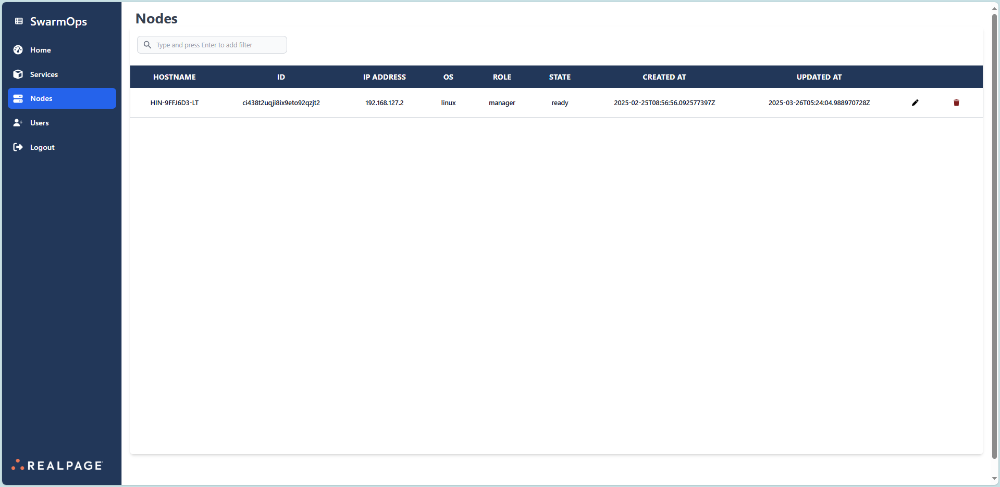

# Nodes

The **Nodes** section of SwarmOps provides a detailed overview of the nodes within the application. It is designed to help users monitor and manage node configurations effectively.

## Overview

This section includes a tabular representation displaying critical details for each node, such as:
- **Hostname**
- **ID**
- **IP Address**
- **Operating System**
- **Role** (e.g., manager, worker)
- **State** (e.g., ready, inactive)
- **Created At**
- **Updated At**

Additional functionalities include:
- **Search Bar:** Allows users to quickly filter and locate specific nodes.
- **Edit and Delete Options:** Icons available for modifying or removing nodes as required.

## Visual Representation

_This image illustrates the layout and detailed structure of the Nodes section._

---

**[← Go Back to the User Guide](../user-guide.md)**