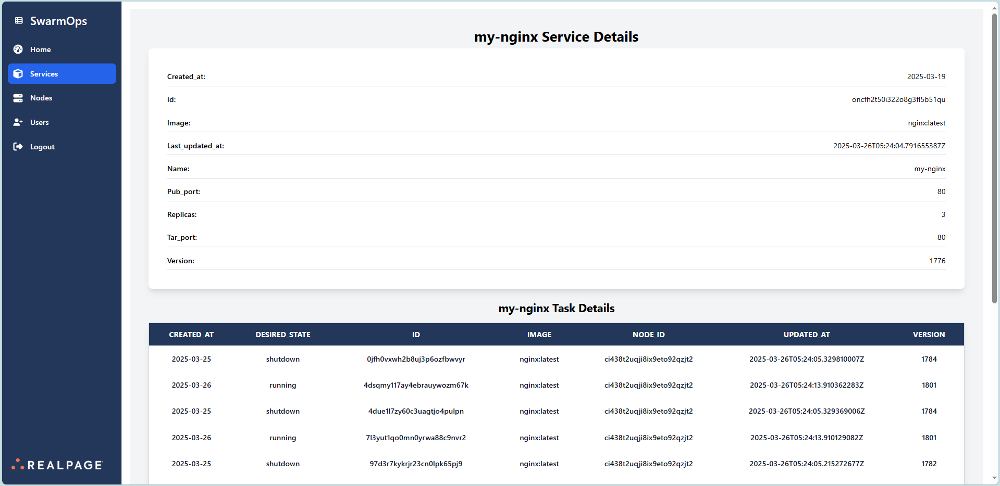

# Service Inspection

The **Service Inspection** feature in SwarmOps provides detailed insights into the selected service, allowing users to monitor its configuration and operational state effectively.

## Task Details

For the inspected service, task-specific information is displayed in a tabular format, including:
- **Created At**
- **Desired State**: Indicates whether the task is running or shutdown.
- **ID**
- **Image**
- **Node ID**: The node on which the task is executed.
- **Updated At**
- **Version**

## Visual Reference

_The image above illustrates the task details provided during service inspection._

---

**[← Back to the user-guide](../user-guide.md)**

