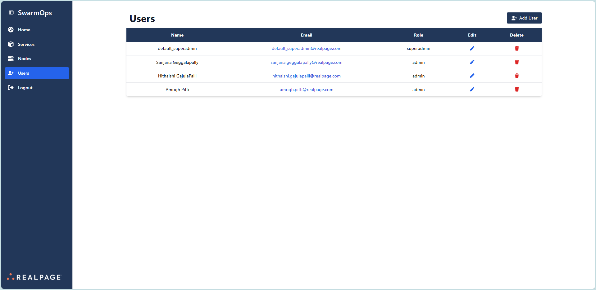
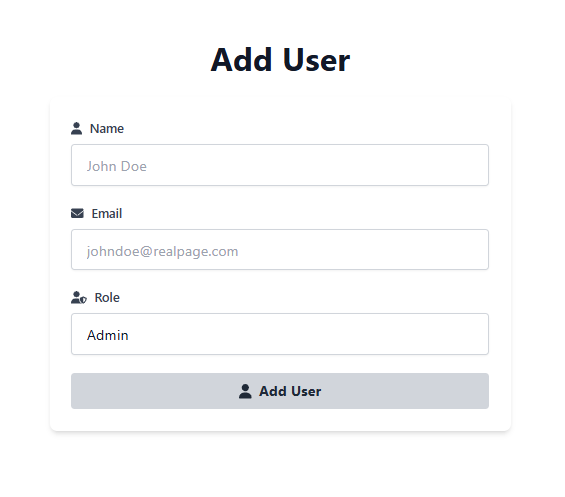

# Users Section

The **Users Section** in SwarmOps provides an intuitive interface for managing user accounts, enabling easy viewing, addition, editing, and deletion of users.

## User Details

For each user, the following information is displayed in a tabular format:
- **Name**: The user's full name.
- **Email**: The user's email address for contact.
- **Role**: The user's permission level (e.g., Admin, Superadmin).
- **Actions**: Options to edit or delete the user.

## Visual Reference

_The image above illustrates the layout and functionality of the Users Section._

## Add User

The **Add User** feature allows administrators to add new users to the system. The form includes the following fields:
- **Name**: A text field to enter the user's full name.
- **Email**: A text field to enter the user's email address.
- **Role**: A dropdown or text field to specify the user's role (e.g., Admin, Superadmin).
- **Add User Button**: A button to submit the form and add the user to the system.

## Visual Reference

_The image above illustrates the add-user feature._

---

**[← Go Back to the User Guide](../user-guide.md)**